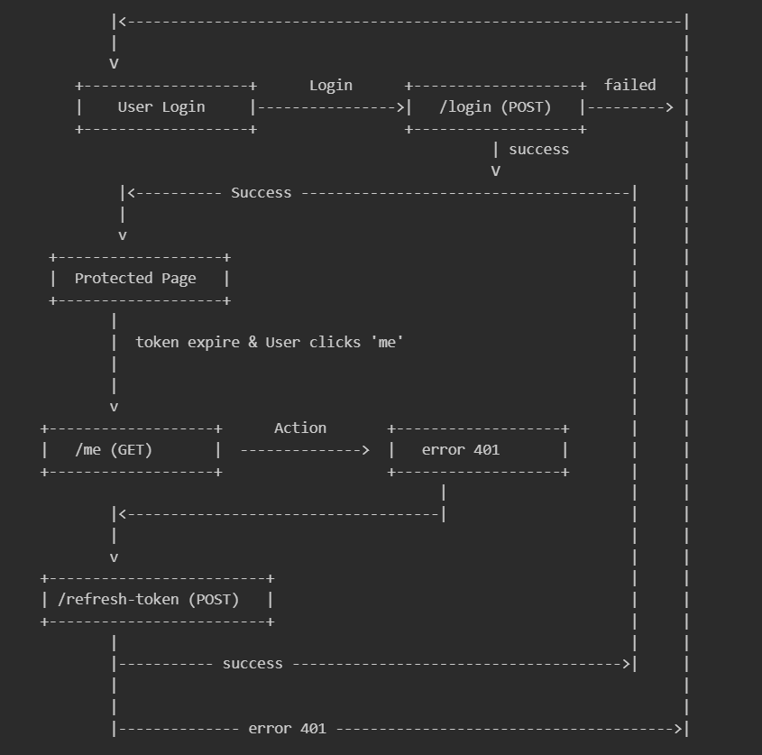

# Auth Example: Flexible Authentication for Web Apps

Authentication is a cornerstone of every serious web application. This project shows how you can build a robust, secure, and flexible authentication system using React, TypeScript, and Express.js with just a simple config change, you can switch between [HTTP-only cookies](https://developer.mozilla.org/en-US/docs/Web/HTTP/Guides/Cookies#security), [Authorization headers](https://developer.mozilla.org/en-US/docs/Web/HTTP/Reference/Headers/Authorization), or both.

---

## Visual Workflow



---

## Flexible Axios Configuration: Cookies & Auth Header

The core of this project’s flexibility is the custom API client configuration in `app/api/axios.ts` using [axios interceptors](https://axios-http.com/docs/interceptors), a powerful feature of the Axios library that acts as middleware to intercept and modify HTTP requests/responses globally before they are processed.

```typescript
// app/api/axios.ts
function createApiInstance(config: ApiConfig = defaultConfig) {
  api.interceptors.request.use(
    (requestConfig) => {
      if (config.useAuthHeader) {
        const token = getToken(config.tokenStorageKey);
        if (token) {
          requestConfig.headers.Authorization = `Bearer ${token}`;
        }
      }
      return requestConfig;
    },
    (error) => Promise.reject(error)
  );

  api.interceptors.response.use(
    (response) => {
      if (config.useAuthHeader && response.data?.token) {
        setToken(response.data.token, config.tokenStorageKey);
      }
      return response;
    },
    async (error) => {
      const originalRequest = error.config;
      if (
        error.response &&
        error.response.status === 401 &&
        !originalRequest._retry &&
        !originalRequest.url.endsWith("/login") &&
        !originalRequest.url.endsWith("/refresh-token")
      ) {
        // ...token refresh logic...
      }
      return Promise.reject(error);
    }
  );
}
```

The API client is designed for flexibility. You can use HTTP-only cookies (default), Authorization header, or both by changing the import

```typescript
// app/api/axios.ts
export const apiWithCredentials = createApiInstance({
  useCredentials: true, // HTTP-only cookies (default)
  useAuthHeader: false,
});

export const apiWithAuthHeader = createApiInstance({
  useCredentials: false,
  useAuthHeader: true, // Bearer token in header
  tokenStorageKey: "accessToken",
});

export const apiWithBoth = createApiInstance({
  useCredentials: true,
  useAuthHeader: true,
  tokenStorageKey: "accessToken",
});
```

Switch between them in your code:

```typescript
import apiWithCredentials from "~/api/axios"; // cookies (default)
import { apiWithAuthHeader } from "~/api/axios"; // header
import { apiWithBoth } from "~/api/axios"; // both
```

All token refresh, storage, and header logic is handled for you.

---

## Data Loading: clientLoader, Hydrate, and HydrateFallback

[React Router v7](https://reactrouter.com/home) enables powerful [data loading and hydration patterns](https://reactrouter.com/start/framework/data-loading). The `clientLoader` is used to fetch data on the client, and you can force it to run during hydration and before the page renders by setting the `hydrate` property. In this situation, you should render a `HydrateFallback` component to show a fallback UI while the client loader runs. Here’s how you can protect routes and provide a smooth user experience via a protected layout route:

```typescript
// app/components/layouts/protected-route.tsx
import apiWithCredentials from "~/api/axios";
import { data, Outlet } from "react-router";
import { serverUrl } from "utils/server-util";

export async function clientLoader() {
  try {
    await apiWithCredentials.get(serverUrl + "/me");
    return null;
  } catch (error) {
    console.error("Error fetching user data:", error);
    throw data("Unauthorized", { status: 401 });
  }
}

clientLoader.hydrate = true as const;

export function HydrateFallback() {
  return (
    <div className="hero min-h-screen">
      <div className="hero-content text-center">
        <p>Loading...</p>
      </div>
    </div>
  );
}
```

- **clientLoader**: Fetches data on the client (browser). Can be forced to run during hydration.
- **hydrate**: If set to true, runs the clientLoader during hydration and before the page renders.
- **HydrateFallback**: Shows a fallback UI while the clientLoader runs during hydration.

Here’s how you use the API client in your React components for protected actions:

```typescript
// app/routes/protected-page.tsx
import apiWithCredentials from "~/api/axios";
import { Link, useNavigate } from "react-router";
import { serverUrl } from "utils/server-util";

export default function ProtectedPage() {
  const navigate = useNavigate();

  const handleMe = async () => {
    try {
      const response = await apiWithCredentials.get(serverUrl + "/me");
      const data = response.data;
      alert("Name: " + data.user?.name);
    } catch (error) {
      alert("Error fetching user data");
      navigate("/");
    }
  };

  const handleLogout = async () => {
    try {
      const response = await apiWithCredentials.post(serverUrl + "/logout");
      alert(response.data.message);
    } finally {
      navigate("/");
    }
  };

  const handleRefreshToken = async () => {
    try {
      const response = await apiWithCredentials.post(
        serverUrl + "/refresh-token"
      );
      alert(response.data.message);
    } catch (error) {
      alert("Error refreshing token");
      navigate("/");
    }
  };

  return (
    <div>
      <button onClick={handleMe}>me</button>
      <button onClick={handleRefreshToken}>refresh-token</button>
      <button onClick={handleLogout}>logout</button>
    </div>
  );
}
```

- **handleMe**: Fetches user info from a protected endpoint.
- **handleLogout**: Logs out and clears tokens/cookies.
- **handleRefreshToken**: Manually triggers a token refresh.

---

## Getting Started

1. Clone the repo and install dependencies
2. Start the backend and frontend (see README)
3. Try logging in with user1/password1 or user2/password2
4. Change the API import to try different auth modes

---

## Conclusion

Auth Example is a practical, template for building secure and flexible authentication in your own apps. Dive into the code, experiment with the configuration, and make it your own—the future of authentication is seamless, secure, and developer-friendly!
